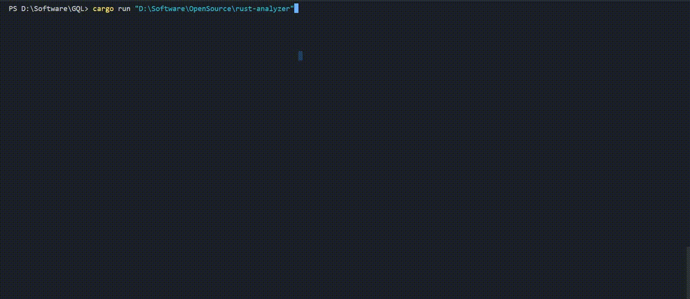

<h1 align="center">GQL - Git Query Language</h1></br>

<p align="center">

</p>

<p align="center">
  
  
  
  
  
  
  
  
</p>

<p align="center">
GQL is a query language with a syntax very similar to SQL with a tiny engine to perform queries on .git files instead of database files. The engine executes the query on the fly without the need to create database files or convert .git files into any other format. 
</p>

<p align="center">
  
</p>

---

### Samples

Note that all Keywords in GQL are case-insensitive, similar to SQL.

```sql
SELECT 1
SELECT 1 + 2
SELECT LEN("Git Query Language")
SELECT "One" IN ("One", "Two", "Three")
SELECT "Git Query Language" LIKE "%Query%"

SELECT DISTINCT title AS tt FROM commits
SELECT name, COUNT(name) AS commit_num FROM commits GROUP BY name ORDER BY commit_num DESC LIMIT 10
SELECT commit_count FROM branches WHERE commit_count BETWEEN 0 .. 10

SELECT * FROM refs WHERE type = "branch"
SELECT * FROM refs ORDER BY type

SELECT * FROM commits
SELECT name, email FROM commits
SELECT name, email FROM commits ORDER BY name DESC, email ASC
SELECT name, email FROM commits WHERE name LIKE "%gmail%" ORDER BY name
SELECT * FROM commits WHERE LOWER(name) = "amrdeveloper"
SELECT name FROM commits GROUP By name
SELECT name FROM commits GROUP By name having name = "AmrDeveloper"

SELECT * FROM branches
SELECT * FROM branches WHERE is_head = true
SELECT name, LEN(name) FROM branches

SELECT * FROM tags
SELECT * FROM tags OFFSET 1 LIMIT 1
```

---

## Documentation:

  - [Full Documentation](https://amrdeveloper.github.io/GQL/)
  - [Install or Build](docs/setup.md)
  - [Tables](docs/structure/tables.md)
  - [Types](docs/structure/types.md)
  - [Statements](docs/statement)
  - [Expressions](docs/expression)
  - [Transformations](docs/function/transformations.md)
  - [Aggregations](docs/function/aggregations.md)
  - [As Libraries](docs/libraries.md)

---

### License
```
MIT License

Copyright (c) 2023 Amr Hesham

Permission is hereby granted, free of charge, to any person obtaining a copy
of this software and associated documentation files (the "Software"), to deal
in the Software without restriction, including without limitation the rights
to use, copy, modify, merge, publish, distribute, sublicense, and/or sell
copies of the Software, and to permit persons to whom the Software is
furnished to do so, subject to the following conditions:

The above copyright notice and this permission notice shall be included in all
copies or substantial portions of the Software.

THE SOFTWARE IS PROVIDED "AS IS", WITHOUT WARRANTY OF ANY KIND, EXPRESS OR
IMPLIED, INCLUDING BUT NOT LIMITED TO THE WARRANTIES OF MERCHANTABILITY,
FITNESS FOR A PARTICULAR PURPOSE AND NONINFRINGEMENT. IN NO EVENT SHALL THE
AUTHORS OR COPYRIGHT HOLDERS BE LIABLE FOR ANY CLAIM, DAMAGES OR OTHER
LIABILITY, WHETHER IN AN ACTION OF CONTRACT, TORT OR OTHERWISE, ARISING FROM,
OUT OF OR IN CONNECTION WITH THE SOFTWARE OR THE USE OR OTHER DEALINGS IN THE
SOFTWARE.
```
