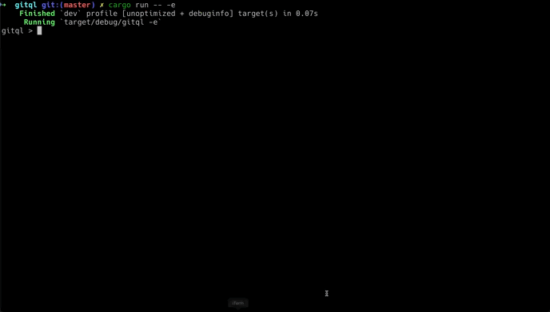

<h1 align="center">GitQL - Git Query Language</h1></br>

<p align="center">

</p>

<p align="center">
  
  
  
  
  
  
  
  
</p>

<p align="center">
GitQL is a tool that built using the GitQL SDk to perform SQL like query on your local .git files
</p>

<p align="center">
GitQL SDK is an in memory query engine implemented from scratch as a set of libraries that allow you to perform high customization in types, schema, data provider, operators and functions, so you can build your own tool to run SQL like query on any kind of data. 
</p>

<p align="center">
  
</p>

---

### Samples

Note that all Keywords in GitQL are case-insensitive, similar to SQL.

```sql
SELECT 1
SELECT 1 + 2
SELECT LEN("Git Query Language")
SELECT "One" IN ("One", "Two", "Three")
SELECT "Git Query Language" LIKE "%Query%"

SET @arr = [1, 2, 3];
SELECT [[1, 2, 3], [4, 5, 6], [7, 8, 9]];
SELECT @arr[1], @arr[2], @arr[3], ARRAY_LENGTH(@arr);
SELECT @arr[1:2], @arr[2:], @arr[:2];

SELECT DISTINCT title AS tt FROM commits
SELECT author_name, COUNT(author_name) AS commit_num FROM commits GROUP BY author_name, author_email ORDER BY commit_num DESC LIMIT 10
SELECT commit_count FROM branches WHERE commit_count BETWEEN 0 AND 10

SELECT * FROM refs WHERE type = "branch"
SELECT * FROM refs ORDER BY type

SELECT * FROM commits
SELECT author_name, author_email FROM commits
SELECT author_name, author_email FROM commits ORDER BY author_name DESC, author_email ASC
SELECT author_name, author_email FROM commits WHERE author_email LIKE "%gmail%" ORDER BY author_name
SELECT * FROM commits WHERE LOWER(author_name) = "amrdeveloper"
SELECT author_name FROM commits GROUP By author_name
SELECT author_name FROM commits GROUP By author_name having author_name = "AmrDeveloper"

SELECT * FROM branches
SELECT * FROM branches WHERE is_head = true
SELECT name, LEN(name) FROM branches

SELECT * FROM tags
SELECT * FROM tags OFFSET 1 LIMIT 1
```

---

## GitQL Documentation

- [Full Documentation](https://amrdeveloper.github.io/GQL/)
- [Install or Build](https://amrdeveloper.github.io/GQL/setup)
- [Tables](https://amrdeveloper.github.io/GQL/structure/tables)
- [Types](https://amrdeveloper.github.io/GQL/structure/types)
- [Statements](https://amrdeveloper.github.io/GQL/statement)
- [Expressions](https://amrdeveloper.github.io/GQL/expression)
- [Functions and Operators](https://amrdeveloper.github.io/GQL/functions)
- [Aggregations](https://amrdeveloper.github.io/GQL/functions/aggregations)

## GitQL SDK Documentations

- [GitQL SDK](https://amrdeveloper.github.io/GQL/sdk/)
- [Customize the Data Schema](https://amrdeveloper.github.io/GQL/sdk/schema.md).
- [Customize the Data Provider](https://amrdeveloper.github.io/GQL/sdk/provider.md).
- [Customize the Standard library](https://amrdeveloper.github.io/GQL/sdk/functions.md).
- [Customize the Type system](https://amrdeveloper.github.io/GQL/sdk/types.md).
- [Customize the Value system](https://amrdeveloper.github.io/GQL/sdk/values.md).
- [Connect Components together](https://amrdeveloper.github.io/GQL/sdk/assemble.md).

---

## Tools built using GitQL SDK

- [LLQL](https://github.com/amrdeveloper/llql):
  Tool to run SQL query on LLVM IR/BC and perform Pattern matching on instructions.
- [ClangQL](https://github.com/amrdeveloper/clangql):
  Tool to run SQL query on C/C++ Source code files.
- [FileQL](https://github.com/amrdeveloper/fileql)
  Tool to run SQL query on file systems and extract metadata.
- [PyQL](https://github.com/AmrDeveloper/PyQL)
  Tool to run SQL query on Python Source code files.

---

### License
```
MIT License

Copyright (c) 2023 Amr Hesham

Permission is hereby granted, free of charge, to any person obtaining a copy
of this software and associated documentation files (the "Software"), to deal
in the Software without restriction, including without limitation the rights
to use, copy, modify, merge, publish, distribute, sublicense, and/or sell
copies of the Software, and to permit persons to whom the Software is
furnished to do so, subject to the following conditions:

The above copyright notice and this permission notice shall be included in all
copies or substantial portions of the Software.

THE SOFTWARE IS PROVIDED "AS IS", WITHOUT WARRANTY OF ANY KIND, EXPRESS OR
IMPLIED, INCLUDING BUT NOT LIMITED TO THE WARRANTIES OF MERCHANTABILITY,
FITNESS FOR A PARTICULAR PURPOSE AND NONINFRINGEMENT. IN NO EVENT SHALL THE
AUTHORS OR COPYRIGHT HOLDERS BE LIABLE FOR ANY CLAIM, DAMAGES OR OTHER
LIABILITY, WHETHER IN AN ACTION OF CONTRACT, TORT OR OTHERWISE, ARISING FROM,
OUT OF OR IN CONNECTION WITH THE SOFTWARE OR THE USE OR OTHER DEALINGS IN THE
SOFTWARE.
```
